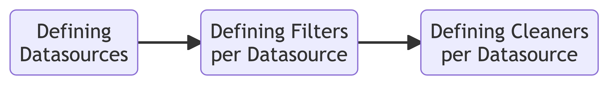

squeakily
================

<!-- WARNING: THIS FILE WAS AUTOGENERATED! DO NOT EDIT! -->

This repository is heavily inspired by BigScience’s [ROOTs
project](https://github.com/bigscience-workshop/data-preparation) and
EleutherAI’s [The Pile](https://github.com/EleutherAI/the-pile).

The overall pipeline is as follows:

<div>

<p>



</p>

</div>

In this library, we define filtering as data instances being removed
from the dataset based on some criteria and cleaning as data instances
being modified in some way.

## Install

``` sh
pip install squeakily
```

## How to use

### Using the API

First, we need to define a datasource. `squeakily` accepts any `Dataset`
object from the [HuggingFace
Datasets](https://huggingface.co/docs/datasets/index) library. For
example, we can use the
[wikitext](https://huggingface.co/datasets/wikitext) dataset:

``` python
from datasets import load_dataset

ds = load_dataset("wikitext", "wikitext-103-v1", split="train[:1%]")
```

We simply need to wrap the `Dataset` object in a dictionary, with the
key being the name of the datasource and the value being the `Dataset`
object, the filter and cleaners. For example:

``` python
from squeakily.filter import check_char_repetition, check_flagged_words
from squeakily.clean import remove_empty_lines, normalize_whitespace

datasources = [
    {
        "dataset": ds,
        "name": "wikitext",
        "columns": ["text"],
        "filters": [check_char_repetition, check_flagged_words],
        "cleaners": [remove_empty_lines, normalize_whitespace],
    },
    # ...
]
```

<div>

> **Warning**
>
> Note: The order of the filters and cleaning functions matter. Filters
> and cleaners are applied in the order they are defined.

</div>

<div>

> **Important**
>
> Note: As of now, we only use the first column of the given column
> names. This is because the `squeakily` library is designed to work
> with language datasets, which usually have a single column of text.
> Future versions will support multiple columns.

</div>

Finally, we can apply the filters and cleaners to the datasouces using a
[`Pipeline`](https://CarperAI.github.io/squeakily/core.html#pipeline)
object:

``` python
from squeakily.core import Pipeline

pipeline = Pipeline(datasources)
pipeline.run()
```

<pre style="white-space:pre;overflow-x:auto;line-height:normal;font-family:Menlo,'DejaVu Sans Mono',consolas,'Courier New',monospace"><span style="color: #7fbfbf; text-decoration-color: #7fbfbf">[11/16/22 04:32:57] </span><span style="color: #000080; text-decoration-color: #000080">INFO    </span> Running datasource: wikitext                                                <a href="file:///fsx/home-nathan/work/squeakily/squeakily/core.py" target="_blank"><span style="color: #7f7f7f; text-decoration-color: #7f7f7f">core.py</span></a><span style="color: #7f7f7f; text-decoration-color: #7f7f7f">:</span><a href="file:///fsx/home-nathan/work/squeakily/squeakily/core.py#41" target="_blank"><span style="color: #7f7f7f; text-decoration-color: #7f7f7f">41</span></a>
</pre>
<pre style="white-space:pre;overflow-x:auto;line-height:normal;font-family:Menlo,'DejaVu Sans Mono',consolas,'Courier New',monospace"><span style="color: #7fbfbf; text-decoration-color: #7fbfbf">                    </span><span style="color: #000080; text-decoration-color: #000080">INFO    </span> Running filter: check_char_repetition on text                               <a href="file:///fsx/home-nathan/work/squeakily/squeakily/core.py" target="_blank"><span style="color: #7f7f7f; text-decoration-color: #7f7f7f">core.py</span></a><span style="color: #7f7f7f; text-decoration-color: #7f7f7f">:</span><a href="file:///fsx/home-nathan/work/squeakily/squeakily/core.py#54" target="_blank"><span style="color: #7f7f7f; text-decoration-color: #7f7f7f">54</span></a>
</pre>
<pre style="white-space:pre;overflow-x:auto;line-height:normal;font-family:Menlo,'DejaVu Sans Mono',consolas,'Courier New',monospace"><span style="color: #7fbfbf; text-decoration-color: #7fbfbf">                    </span><span style="color: #000080; text-decoration-color: #000080">INFO    </span> Running filter: check_flagged_words on text                                 <a href="file:///fsx/home-nathan/work/squeakily/squeakily/core.py" target="_blank"><span style="color: #7f7f7f; text-decoration-color: #7f7f7f">core.py</span></a><span style="color: #7f7f7f; text-decoration-color: #7f7f7f">:</span><a href="file:///fsx/home-nathan/work/squeakily/squeakily/core.py#54" target="_blank"><span style="color: #7f7f7f; text-decoration-color: #7f7f7f">54</span></a>
</pre>
<pre style="white-space:pre;overflow-x:auto;line-height:normal;font-family:Menlo,'DejaVu Sans Mono',consolas,'Courier New',monospace"><span style="color: #7fbfbf; text-decoration-color: #7fbfbf">                    </span><span style="color: #000080; text-decoration-color: #000080">INFO    </span> Running cleaner: remove_empty_lines on text                                 <a href="file:///fsx/home-nathan/work/squeakily/squeakily/core.py" target="_blank"><span style="color: #7f7f7f; text-decoration-color: #7f7f7f">core.py</span></a><span style="color: #7f7f7f; text-decoration-color: #7f7f7f">:</span><a href="file:///fsx/home-nathan/work/squeakily/squeakily/core.py#57" target="_blank"><span style="color: #7f7f7f; text-decoration-color: #7f7f7f">57</span></a>
</pre>
<pre style="white-space:pre;overflow-x:auto;line-height:normal;font-family:Menlo,'DejaVu Sans Mono',consolas,'Courier New',monospace"><span style="color: #7fbfbf; text-decoration-color: #7fbfbf">[11/16/22 04:32:59] </span><span style="color: #000080; text-decoration-color: #000080">INFO    </span> Running cleaner: normalize_whitespace on text                               <a href="file:///fsx/home-nathan/work/squeakily/squeakily/core.py" target="_blank"><span style="color: #7f7f7f; text-decoration-color: #7f7f7f">core.py</span></a><span style="color: #7f7f7f; text-decoration-color: #7f7f7f">:</span><a href="file:///fsx/home-nathan/work/squeakily/squeakily/core.py#57" target="_blank"><span style="color: #7f7f7f; text-decoration-color: #7f7f7f">57</span></a>
</pre>

<div>

> **Note**
>
> Note: If you want to run cleaners first, you can pass
> `cleaning_first=True` to the `run` function.
>
> ``` python
> pipeline.run(cleaning_first=True)
> ```

</div>

If you need to run a filter or cleaner at the dataset level rather than
the example level, you can pass `global_filters` or `global_cleaners` to
the
[`Pipeline.run`](https://CarperAI.github.io/squeakily/core.html#pipeline.run)
function. For example:

``` python
from squeakily.filter import minhash_dedup

pipeline.run(global_filters=[minhash_dedup])
```

<div>

> **Note**
>
> Note: If you use global filters or cleaners, all datasets must have a
> common column name in order to properly concatenate them.

</div>

<div>

> **Note**
>
> Note: You can also specifiy if you want a specific dataset to be
> skipped by setting the `skip_global` parameter to `True` when defining
> the datasource.
>
> ``` python
> datasources = [
>     {
>         "dataset": ds,
>         "columns": ["text"],
>         "filters": [check_char_repetition, check_flagged_words],
>         "cleaners": [remove_empty_lines, normalize_whitespace],
>         "skip_global": True,
>     },
>     # ...
> ]
> ```

</div>

Additionally, you can run the pipeline in a dry run mode by passing
`dry_run=True` to the `run` function. This will make no modifications to
the datasets’ documents, but will add additional columns to the datasets
with the results of the filters and cleaners. For example, if you if you
ran the pipeline with the
[`check_char_repetition`](https://CarperAI.github.io/squeakily/filter.html#check_char_repetition)
filter, you would get a new column called
[`check_char_repetition`](https://CarperAI.github.io/squeakily/filter.html#check_char_repetition)
with a float value between 0 and 1 indicating the percentage of
characters that are repeated in the document.

``` python

::: {.cell}
``` {.python .cell-code}
pipeline = Pipeline(datasources)
pipeline.run(dry_run=True)
pipeline.datasources[0]["dataset"].features
```

:::
